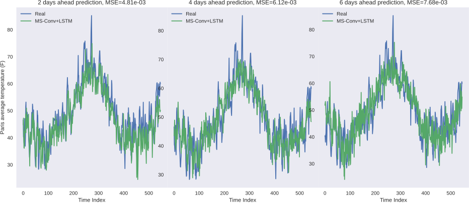
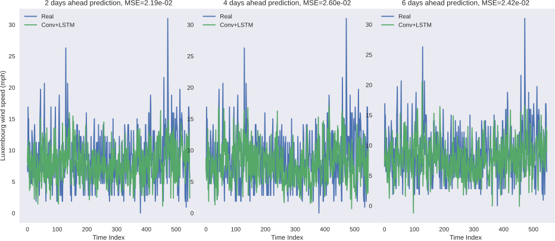

☀️ Deep multi-stations weather forecasting: explanable recurrent convolutional neural networks
========

This project aims to perform multi-stations weather forecasting using recurrent convolutional neural networks accross cities from Europe. Explanability techniques have also been used to detect important cities and weather features. The original paper can be found at:

📊 Results
-----
Some plots of the actual vs prediction of the 2 best models : the Conv+LSTM and MS-Conv+LSTM.

💻 Installation
-----

The required modules can be installed  via:

.. code:: bash

    pip install -r requirements.txt

Quick Start
~~~~~~~~~~~
To train the 4 models for the 2 weather features and the 6 steps ahead, and for 10 epochs:

.. code:: bash

    python Train.py  --epochs 10 
    
.. code::

    usage: Train.py [-h] [-e EPOCHS] 
                       
    list of arguments:
    -h, --help             show this help message and exit
    -e, --epochs           Please choose the number of epochs, by default 1 epoch
    
Note 1: If you want to train for a specific model/weather feature/step ahead, please change the first lines of the Train.py file (18-20)
    
To test the pretrained best configurations (Conv+LSTM and MS-Conv+LSTM):

.. code:: bash
    
    python Test.py -m conv_plus_lstm -s 2 -f wind_speed
    
.. code::

    usage: Test.py [-h] [-m MODEL {conv_plus_lstm,ms_conv_plus_lstm}] [-s STEPSAHEAD {2,4,6}]
                   [-f FEATURE {wind_speed,avg_temperature}]
    
    list of arguments:
    -h, --help         show this help message and exit
    -m, --model        Please choose the type of model you want to train (conv_plus_lstm or ms_conv_plus_lstm)
    -s, --stepsahead   Please choose the number of steps ahead (2, 4, or 6), by default 2
    -f, --feature      Please choose the weather feature you want to forecast (wind_speed or avg_temperature),
                       by default avg_temperature
                           

📂 Data
-----

The preprocessed data for each city is contained in the data directory.

In order to get the original, non-normalized data with discrete values, please write to both of the following addresses:

i.alaouiabdellaoui@student.maastrichtuniversity.nl

siamak.mehrkanoon@maastrichtuniversity.nl

📜 Scripts
-----

- The scripts contain the models, the data preprocessing, as well as the training and testing files.
- Additionaly, you can find pretrained models in the "saved_models" folders, for the 2 weather features, and the 3 steps ahead..

🔗 Citation
-----

If you decide to cite our project in your paper or use our data, please use the following bibtex reference:

.. code:: bibtex

    @misc{alaoui2020towards,
        title={Towards deep multi-stations weather forecasting: explanable recurrent convolutional neural networks},
        author={Ismail Alaoui Abdellaoui and Siamak Mehrkanoon},
        year={2020},
        eprint={},
        archivePrefix={arXiv},
        primaryClass={cs.LG}
    }
